# SporeKart System Architecture & Technical Design Specification

> **Author**: FAANG Principal Systems Architect  
> **Status**: APPROVED / ARCHITECTURE SPECIFICATION v2.0  
> **Target Platform**: SporeKart E-Commerce & Training Platform  
> **Stack**: Java 21 (Spring Boot 3.x Modular Monolith), React + Vite + Tailwind CSS, H2 (Dev) / PostgreSQL (Prod), Passwordless JWT Security (Google OAuth2, Phone/Email OTP), Razorpay, Shiprocket / Universal Logistics Adapter  

---

## 1. Executive Summary & Core Architectural Enhancements (v2.0)

SporeKart v2.0 expands the platform from pure e-commerce to a dual-engine ecosystem combining **Product E-Commerce** and **Mushroom Cultivation & Biotech Training Modules**.

### Key Architectural Evolution in v2.0
1. **Passwordless Authentication Engine**: Complete elimination of legacy password logins. Authentication strictly enforces **Google OAuth 2.0**, **Phone SMS OTP**, or **Email Magic Code/OTP**.
2. **Deferred Authentication (Guest-First Access)**: Buyers and Trainees experience zero login walls while browsing catalog items or viewing training courses. Authentication is triggered strictly at transactional conversion boundaries (**Checkout** for Buyers, **Batch Enrollment** for Trainees).
3. **Role & Permission Governance**:
   - **`ADMIN`**: Absolute system control (Catalog management, Training batch creation, Certificate issuance, Shipping control, System analytics).
   - **`BUYER`**: Product consumer profile.
   - **`TRAINEE`**: Training batch participant profile.
4. **Immutable Identity Standard**: Core identity attributes (`firstName`, `lastName`, `email`, `phoneNumber`) are **strictly immutable** once captured at registration/first login.
5. **Self-Service Account Deletion**: Users possess direct, unmediated control over account deletion under Settings. Admins have **zero override control** to delete or prevent self-deletion of user accounts.
6. **Training Engine & PDF Certificate Management**: Dynamic lifecycle management for training batches (`FEATURED`, `ACTIVE`, `COMPLETED`) with PDF certificate generation and storage.

---

## 2. High-Level System Architecture

```mermaid
graph TD
    subgraph Client Layer [Frontend - React + Vite + Tailwind]
        GuestUser["Guest Visitor (Unauthenticated)"]
        BuyerUser["Authenticated Buyer"]
        TraineeUser["Authenticated Trainee"]
        AdminUser["Platform Admin"]
    end

    subgraph API Security & Gateway Boundary
        SpringSecurity["Spring Security Filter Chain"]
        JWTFilter["Stateless JWT Authentication Filter"]
        PasslessAuth["Passwordless Auth Engine (OAuth2 / OTP)"]
    end

    subgraph Modular Monolith Engine [Java 21 - Spring Boot 3.x]
        direction TB
        
        subgraph Core Domain Modules
            IAMModule["IAM Module<br/>(OAuth2, OTP, Immutability Guards, Self-Delete)"]
            CatalogModule["Catalog Module<br/>(Products, Stock, Variants)"]
            CartOrderModule["Cart & Order Module<br/>(Cart Sync, Guest Checkout)"]
            TrainingModule["Training Module<br/>(Batches, Enrollments, PDF Certificates)"]
            PaymentModule["Payment Engine<br/>(Razorpay Adapter)"]
            ShippingModule["Shipping Engine<br/>(Shiprocket Adapter)"]
            NotificationModule["Notification Engine<br/>(SMS OTP, Email OTP, Webhooks)"]
        end
        
        EventBus["Spring Event Bus / ApplicationEventPublisher"]
    end

    subgraph External Identity & Gateway Integrations
        GoogleOAuth["Google OAuth 2.0 API"]
        TwilioSMS["SMS Gateway (OTP Provider)"]
        RazorpayAPI["Razorpay Payment Gateway"]
        ShiprocketAPI["Shiprocket Logistics API"]
    end

    subgraph Storage & Media Engine
        DB[(H2 Dev / PostgreSQL Prod)]
        MediaStore[(Certificate PDF & Assets Store)]
    end

    GuestUser -->|Browse Products & Courses| SpringSecurity
    BuyerUser -->|Checkout Product| PasslessAuth
    TraineeUser -->|Enroll in Batch| PasslessAuth
    AdminUser -->|Manage Platform| SpringSecurity

    SpringSecurity --> JWTFilter
    PasslessAuth --> GoogleOAuth
    PasslessAuth --> TwilioSMS
    PasslessAuth --> IAMModule

    CartOrderModule -->|Validate Stock| CatalogModule
    CartOrderModule -->|Execute Payment| PaymentModule
    TrainingModule -->|Enrollment Payment| PaymentModule
    TrainingModule -->|Issue Certificate| MediaStore
    
    CartOrderModule -.->|Publish: OrderPlacedEvent| EventBus
    TrainingModule -.->|Publish: TraineeEnrolledEvent| EventBus
    EventBus -.->|Async SMS/Email| NotificationModule
    EventBus -.->|Trigger Fulfillment| ShippingModule

    IAMModule & CatalogModule & CartOrderModule & TrainingModule & PaymentModule & ShippingModule --> DB
```

