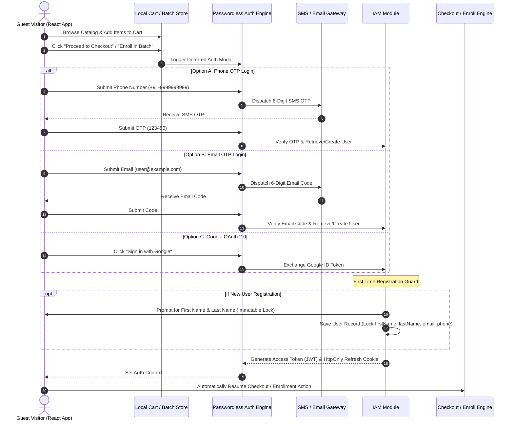
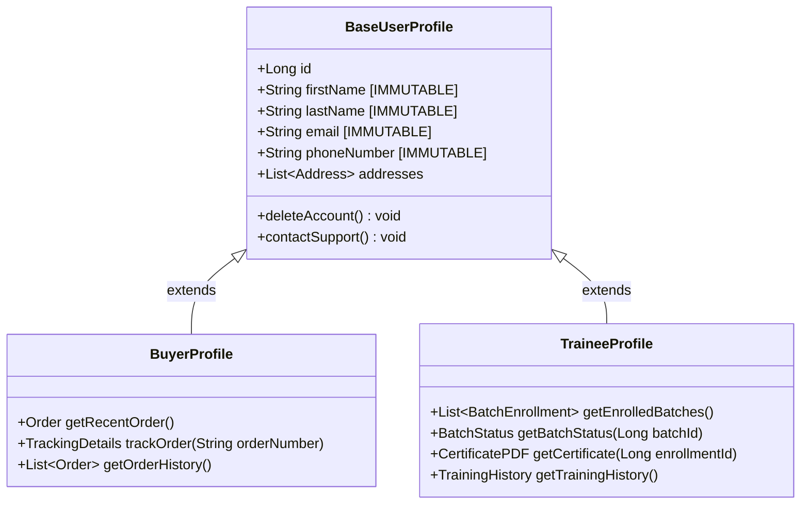
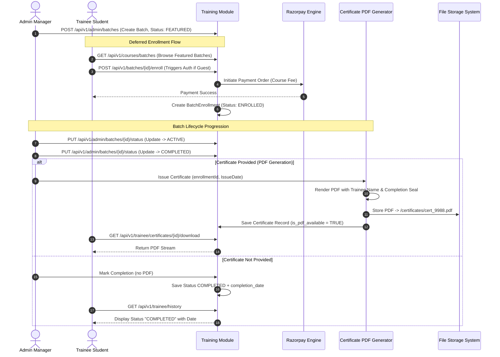

# SporeKart System Architecture & Technical Design Specification

> **Author**: FAANG Principal Systems Architect  
> **Status**: APPROVED / ARCHITECTURE SPECIFICATION v2.0  
> **Target Platform**: SporeKart E-Commerce & Training Platform  
> **Stack**: Java 21 (Spring Boot 3.x Modular Monolith), React + Vite + Tailwind CSS, H2 (Dev) / PostgreSQL (Prod), Passwordless JWT Security (Google OAuth2, Phone/Email OTP), Razorpay, Shiprocket / Universal Logistics Adapter  

---

## 1. Executive Summary & Core Architectural Enhancements (v2.0)

SporeKart v2.0 expands the platform from pure e-commerce to a dual-engine ecosystem combining **Product E-Commerce** and **Mushroom Cultivation & Biotech Training Modules**.

### Key Architectural Evolution in v2.0
1. **Passwordless Authentication Engine**: Complete elimination of legacy password logins. Authentication strictly enforces **Google OAuth 2.0**, **Phone SMS OTP**, or **Email Magic Code/OTP**.
2. **Deferred Authentication (Guest-First Access)**: Buyers and Trainees experience zero login walls while browsing catalog items or viewing training courses. Authentication is triggered strictly at transactional conversion boundaries (**Checkout** for Buyers, **Batch Enrollment** for Trainees).
3. **Role & Permission Governance**:
   - **`ADMIN`**: Absolute system control (Catalog management, Training batch creation, Certificate issuance, Shipping control, System analytics).
   - **`BUYER`**: Product consumer profile.
   - **`TRAINEE`**: Training batch participant profile.
4. **Immutable Identity Standard**: Core identity attributes (`firstName`, `lastName`, `email`, `phoneNumber`) are **strictly immutable** once captured at registration/first login.
5. **Self-Service Account Deletion**: Users possess direct, unmediated control over account deletion under Settings. Admins have **zero override control** to delete or prevent self-deletion of user accounts.
6. **Training Engine & PDF Certificate Management**: Dynamic lifecycle management for training batches (`FEATURED`, `ACTIVE`, `COMPLETED`) with PDF certificate generation and storage.

---

## 2. High-Level System Architecture

```mermaid
graph TD
    subgraph Client Layer [Frontend - React + Vite + Tailwind]
        GuestUser["Guest Visitor (Unauthenticated)"]
        BuyerUser["Authenticated Buyer"]
        TraineeUser["Authenticated Trainee"]
        AdminUser["Platform Admin"]
    end

    subgraph API Security & Gateway Boundary
        SpringSecurity["Spring Security Filter Chain"]
        JWTFilter["Stateless JWT Authentication Filter"]
        PasslessAuth["Passwordless Auth Engine (OAuth2 / OTP)"]
    end

    subgraph Modular Monolith Engine [Java 21 - Spring Boot 3.x]
        direction TB
        
        subgraph Core Domain Modules
            IAMModule["IAM Module<br/>(OAuth2, OTP, Immutability Guards, Self-Delete)"]
            CatalogModule["Catalog Module<br/>(Products, Stock, Variants)"]
            CartOrderModule["Cart & Order Module<br/>(Cart Sync, Guest Checkout)"]
            TrainingModule["Training Module<br/>(Batches, Enrollments, PDF Certificates)"]
            PaymentModule["Payment Engine<br/>(Razorpay Adapter)"]
            ShippingModule["Shipping Engine<br/>(Shiprocket Adapter)"]
            NotificationModule["Notification Engine<br/>(SMS OTP, Email OTP, Webhooks)"]
        end
        
        EventBus["Spring Event Bus / ApplicationEventPublisher"]
    end

    subgraph External Identity & Gateway Integrations
        GoogleOAuth["Google OAuth 2.0 API"]
        TwilioSMS["SMS Gateway (OTP Provider)"]
        RazorpayAPI["Razorpay Payment Gateway"]
        ShiprocketAPI["Shiprocket Logistics API"]
    end

    subgraph Storage & Media Engine
        DB[(H2 Dev / PostgreSQL Prod)]
        MediaStore[(Certificate PDF & Assets Store)]
    end

    %% Client Operations & Guest Access
    GuestUser -->|Browse Products & Courses| SpringSecurity
    BuyerUser -->|Checkout Product| PasslessAuth
    TraineeUser -->|Enroll in Batch| PasslessAuth
    AdminUser -->|Manage Platform| SpringSecurity

    %% Security Flow
    SpringSecurity --> JWTFilter
    PasslessAuth --> GoogleOAuth
    PasslessAuth --> TwilioSMS
    PasslessAuth --> IAMModule

    %% Module Internal Communication
    CartOrderModule -->|Validate Stock| CatalogModule
    CartOrderModule -->|Execute Payment| PaymentModule
    TrainingModule -->|Enrollment Payment| PaymentModule
    TrainingModule -->|Issue Certificate| MediaStore
    
    %% Events
    CartOrderModule -.->|Publish: OrderPlacedEvent| EventBus
    TrainingModule -.->|Publish: TraineeEnrolledEvent| EventBus
    EventBus -.->|Async SMS/Email| NotificationModule
    EventBus -.->|Trigger Fulfillment| ShippingModule

    %% Storage Connections
    IAMModule & CatalogModule & CartOrderModule & TrainingModule & PaymentModule & ShippingModule --> DB
```



---

## 3. Passwordless Authentication & Deferred Auth Architecture

### Deferred Authentication (Guest Conversion Flow)
Unauthenticated users can freely search catalog items, add products to a local session cart, and preview training course details. Authentication is prompted only upon reaching conversion thresholds:



---

## 4. Immutable Identity & Self-Service Deletion Governance

### Immutable Identity Specification
To maintain integrity in financial receipts, logistics waybills, and educational certifications:
- **Immutable Attributes**: `firstName`, `lastName`, `email`, `phoneNumber`.
- **Enforcement Mechanism**:
  1. **Database Guard**: Database constraints prevent `UPDATE` operations on identity columns once `is_identity_locked = TRUE`.
  2. **API Application Guard**: Spring Data JPA `@PreUpdate` entity listeners throw `ImmutableAttributeException` if changes to identity fields are detected.

```java
@Entity
@Table(name = "users")
public class UserEntity {
    @Id
    @GeneratedValue(strategy = GenerationType.IDENTITY)
    private Long id;

    @Column(nullable = false, updatable = false)
    private String email;

    @Column(nullable = false, updatable = false)
    private String phoneNumber;

    @Column(nullable = false, updatable = false)
    private String firstName;

    @Column(nullable = false, updatable = false)
    private String lastName;

    @PreUpdate
    public void preventIdentityMutation() {
        // Enforce hard immutability check against original entity state
    }
}
```

### Self-Service Account Deletion Governance
- **Zero Admin Control**: Account deletion is executed directly by the user via `Settings -> Delete Account`.
- **Admin Restriction**: Admin APIs explicitly **lack endpoints** to delete, modify, or block user account deletion.
- **Cascading Data Safety**:
  - Personal identity data is scrubbed or anonymized (`Deleted User #<ID>`).
  - Financial order history and training certificates are retained in anonymized compliance state for tax/legal audit mandates.

---

## 5. Application Schemas & Database Entity Design

### Entity-Relationship Diagram (ERD v2.0)

```mermaid
erDiagram
    USERS ||--o{ REFRESH_TOKENS : has
    USERS ||--o{ OTP_VERIFICATIONS : requests
    USERS ||--o{ ADDRESSES : owns
    USERS ||--o{ ORDERS : places
    USERS ||--o{ BATCH_ENROLLMENTS : enrolls
    
    CATEGORIES ||--o{ PRODUCTS : contains
    PRODUCTS ||--o{ PRODUCT_VARIANTS : has
    PRODUCT_VARIANTS ||--o{ INVENTORY : tracks
    
    ORDERS ||--o{ ORDER_ITEMS : includes
    ORDERS ||--o1 PAYMENTS : paid_via
    ORDERS ||--o1 SHIPMENTS : shipped_via
    
    TRAINING_COURSES ||--o{ TRAINING_BATCHES : offers
    TRAINING_BATCHES ||--o{ BATCH_ENROLLMENTS : contains
    BATCH_ENROLLMENTS ||--o1 CERTIFICATES : issues

    USERS {
        bigint id PK
        string email UK
        string phone_number UK
        string first_name
        string last_name
        string role
        string auth_provider
        boolean is_identity_locked
        timestamp created_at
    }

    OTP_VERIFICATIONS {
        bigint id PK
        string target
        string otp_code
        string type
        timestamp expires_at
        boolean is_verified
    }

    TRAINING_COURSES {
        bigint id PK
        string title
        string slug UK
        string description
        decimal course_fee
        boolean is_active
    }

    TRAINING_BATCHES {
        bigint id PK
        bigint course_id FK
        string batch_code UK
        string batch_name
        string batch_status
        date start_date
        date end_date
        integer max_capacity
    }

    BATCH_ENROLLMENTS {
        bigint id PK
        bigint user_id FK
        bigint batch_id FK
        bigint payment_id FK
        string enrollment_status
        timestamp enrolled_at
    }

    CERTIFICATES {
        bigint id PK
        bigint enrollment_id FK
        string certificate_number UK
        date issue_date
        string pdf_file_path
        boolean is_pdf_available
    }
```

### SQL DDL Schema (Compatible with H2 & PostgreSQL)

```sql
-- =============================================================================
-- SPOREKART DATABASE SCHEMA v2.0 (H2 Dev & PostgreSQL Prod Compatible)
-- =============================================================================

-- 1. IAM MODULE SCHEMA (Passwordless & Immutable Identity)
CREATE TABLE users (
    id BIGINT GENERATED BY DEFAULT AS IDENTITY PRIMARY KEY,
    email VARCHAR(255) UNIQUE,
    phone_number VARCHAR(20) UNIQUE,
    first_name VARCHAR(100) NOT NULL,
    last_name VARCHAR(100) NOT NULL,
    role VARCHAR(50) NOT NULL CHECK (role IN ('ROLE_ADMIN', 'ROLE_BUYER', 'ROLE_TRAINEE')),
    auth_provider VARCHAR(50) NOT NULL CHECK (auth_provider IN ('GOOGLE_OAUTH', 'PHONE_OTP', 'EMAIL_OTP')),
    is_identity_locked BOOLEAN NOT NULL DEFAULT TRUE,
    created_at TIMESTAMP WITH TIME ZONE DEFAULT CURRENT_TIMESTAMP,
    updated_at TIMESTAMP WITH TIME ZONE DEFAULT CURRENT_TIMESTAMP
);

CREATE TABLE refresh_tokens (
    id BIGINT GENERATED BY DEFAULT AS IDENTITY PRIMARY KEY,
    user_id BIGINT NOT NULL REFERENCES users(id) ON DELETE CASCADE,
    token VARCHAR(512) NOT NULL UNIQUE,
    expires_at TIMESTAMP WITH TIME ZONE NOT NULL,
    created_at TIMESTAMP WITH TIME ZONE DEFAULT CURRENT_TIMESTAMP
);

CREATE TABLE otp_verifications (
    id BIGINT GENERATED BY DEFAULT AS IDENTITY PRIMARY KEY,
    target VARCHAR(255) NOT NULL, -- Email address or Phone number
    otp_code VARCHAR(10) NOT NULL,
    type VARCHAR(20) NOT NULL CHECK (type IN ('PHONE', 'EMAIL')),
    expires_at TIMESTAMP WITH TIME ZONE NOT NULL,
    is_verified BOOLEAN DEFAULT FALSE,
    created_at TIMESTAMP WITH TIME ZONE DEFAULT CURRENT_TIMESTAMP
);

CREATE TABLE addresses (
    id BIGINT GENERATED BY DEFAULT AS IDENTITY PRIMARY KEY,
    user_id BIGINT NOT NULL REFERENCES users(id) ON DELETE CASCADE,
    recipient_name VARCHAR(150) NOT NULL,
    address_line1 VARCHAR(255) NOT NULL,
    address_line2 VARCHAR(255),
    city VARCHAR(100) NOT NULL,
    state VARCHAR(100) NOT NULL,
    postal_code VARCHAR(20) NOT NULL,
    country VARCHAR(100) NOT NULL DEFAULT 'India',
    is_default BOOLEAN DEFAULT FALSE,
    created_at TIMESTAMP WITH TIME ZONE DEFAULT CURRENT_TIMESTAMP
);

-- 2. CATALOG & E-COMMERCE SCHEMA
CREATE TABLE categories (
    id BIGINT GENERATED BY DEFAULT AS IDENTITY PRIMARY KEY,
    name VARCHAR(100) NOT NULL,
    slug VARCHAR(120) NOT NULL UNIQUE,
    description TEXT
);

CREATE TABLE products (
    id BIGINT GENERATED BY DEFAULT AS IDENTITY PRIMARY KEY,
    category_id BIGINT NOT NULL REFERENCES categories(id),
    sku VARCHAR(100) NOT NULL UNIQUE,
    title VARCHAR(255) NOT NULL,
    slug VARCHAR(280) NOT NULL UNIQUE,
    description TEXT,
    base_price DECIMAL(12,2) NOT NULL,
    is_active BOOLEAN NOT NULL DEFAULT TRUE,
    created_at TIMESTAMP WITH TIME ZONE DEFAULT CURRENT_TIMESTAMP
);

CREATE TABLE product_variants (
    id BIGINT GENERATED BY DEFAULT AS IDENTITY PRIMARY KEY,
    product_id BIGINT NOT NULL REFERENCES products(id) ON DELETE CASCADE,
    variant_sku VARCHAR(100) NOT NULL UNIQUE,
    variant_name VARCHAR(100) NOT NULL,
    price_adjustment DECIMAL(12,2) NOT NULL DEFAULT 0.00,
    image_url VARCHAR(500)
);

CREATE TABLE inventory (
    id BIGINT GENERATED BY DEFAULT AS IDENTITY PRIMARY KEY,
    variant_id BIGINT NOT NULL UNIQUE REFERENCES product_variants(id) ON DELETE CASCADE,
    stock_quantity INT NOT NULL DEFAULT 0,
    reserved_quantity INT NOT NULL DEFAULT 0
);

CREATE TABLE orders (
    id BIGINT GENERATED BY DEFAULT AS IDENTITY PRIMARY KEY,
    order_number VARCHAR(64) NOT NULL UNIQUE,
    user_id BIGINT NOT NULL REFERENCES users(id),
    shipping_address_id BIGINT NOT NULL REFERENCES addresses(id),
    total_amount DECIMAL(12,2) NOT NULL,
    tax_amount DECIMAL(12,2) NOT NULL DEFAULT 0.00,
    shipping_fee DECIMAL(12,2) NOT NULL DEFAULT 0.00,
    status VARCHAR(50) NOT NULL DEFAULT 'PENDING_PAYMENT',
    created_at TIMESTAMP WITH TIME ZONE DEFAULT CURRENT_TIMESTAMP
);

CREATE TABLE order_items (
    id BIGINT GENERATED BY DEFAULT AS IDENTITY PRIMARY KEY,
    order_id BIGINT NOT NULL REFERENCES orders(id) ON DELETE CASCADE,
    variant_id BIGINT NOT NULL REFERENCES product_variants(id),
    quantity INT NOT NULL,
    unit_price DECIMAL(12,2) NOT NULL,
    total_price DECIMAL(12,2) NOT NULL
);

-- 3. TRAINING MODULE SCHEMA
CREATE TABLE training_courses (
    id BIGINT GENERATED BY DEFAULT AS IDENTITY PRIMARY KEY,
    title VARCHAR(255) NOT NULL,
    slug VARCHAR(280) NOT NULL UNIQUE,
    description TEXT NOT NULL,
    course_fee DECIMAL(12,2) NOT NULL,
    is_active BOOLEAN NOT NULL DEFAULT TRUE,
    created_at TIMESTAMP WITH TIME ZONE DEFAULT CURRENT_TIMESTAMP
);

CREATE TABLE training_batches (
    id BIGINT GENERATED BY DEFAULT AS IDENTITY PRIMARY KEY,
    course_id BIGINT NOT NULL REFERENCES training_courses(id) ON DELETE CASCADE,
    batch_code VARCHAR(64) NOT NULL UNIQUE,
    batch_name VARCHAR(150) NOT NULL,
    batch_status VARCHAR(50) NOT NULL CHECK (batch_status IN ('FEATURED', 'ACTIVE', 'COMPLETED')),
    start_date DATE NOT NULL,
    end_date DATE NOT NULL,
    max_capacity INT NOT NULL DEFAULT 30,
    created_at TIMESTAMP WITH TIME ZONE DEFAULT CURRENT_TIMESTAMP
);

CREATE TABLE batch_enrollments (
    id BIGINT GENERATED BY DEFAULT AS IDENTITY PRIMARY KEY,
    user_id BIGINT NOT NULL REFERENCES users(id),
    batch_id BIGINT NOT NULL REFERENCES training_batches(id),
    payment_id BIGINT,
    enrollment_status VARCHAR(50) NOT NULL DEFAULT 'ENROLLED',
    enrolled_at TIMESTAMP WITH TIME ZONE DEFAULT CURRENT_TIMESTAMP,
    UNIQUE(user_id, batch_id)
);

CREATE TABLE certificates (
    id BIGINT GENERATED BY DEFAULT AS IDENTITY PRIMARY KEY,
    enrollment_id BIGINT NOT NULL UNIQUE REFERENCES batch_enrollments(id) ON DELETE CASCADE,
    certificate_number VARCHAR(100) NOT NULL UNIQUE,
    issue_date DATE NOT NULL,
    pdf_file_path VARCHAR(500),
    is_pdf_available BOOLEAN NOT NULL DEFAULT FALSE,
    completion_date DATE NOT NULL
);

-- 4. PAYMENT & SHIPPING MODULE SCHEMA
CREATE TABLE payments (
    id BIGINT GENERATED BY DEFAULT AS IDENTITY PRIMARY KEY,
    order_id BIGINT REFERENCES orders(id),
    enrollment_id BIGINT REFERENCES batch_enrollments(id),
    gateway_name VARCHAR(50) NOT NULL DEFAULT 'RAZORPAY',
    razorpay_order_id VARCHAR(100),
    razorpay_payment_id VARCHAR(100),
    razorpay_signature VARCHAR(255),
    amount DECIMAL(12,2) NOT NULL,
    currency VARCHAR(10) NOT NULL DEFAULT 'INR',
    status VARCHAR(50) NOT NULL DEFAULT 'CREATED',
    created_at TIMESTAMP WITH TIME ZONE DEFAULT CURRENT_TIMESTAMP
);

CREATE TABLE shipments (
    id BIGINT GENERATED BY DEFAULT AS IDENTITY PRIMARY KEY,
    order_id BIGINT NOT NULL UNIQUE REFERENCES orders(id),
    provider_name VARCHAR(50) NOT NULL DEFAULT 'SHIPROCKET',
    shiprocket_order_id VARCHAR(100),
    shiprocket_shipment_id VARCHAR(100),
    awb_code VARCHAR(100),
    courier_name VARCHAR(100),
    status VARCHAR(50) NOT NULL DEFAULT 'UNFULFILLED',
    estimated_delivery TIMESTAMP WITH TIME ZONE,
    created_at TIMESTAMP WITH TIME ZONE DEFAULT CURRENT_TIMESTAMP
);
```

---

## 6. Profile Models & Capability Matrices

### Profile Data Specification & Immutability Rules



### Profile Capability Comparison Table

| Profile Feature | Buyer Profile | Trainee Profile | Admin Controls |
| :--- | :--- | :--- | :--- |
| **First Name & Last Name** | Immutable | Immutable | Read-Only |
| **Phone Number & Email** | Immutable | Immutable | Read-Only |
| **Address Management** | Add / Edit / Set Default | Add / Edit / Set Default | View Shipping Address |
| **Order History & Tracking** | Full Access + Real-time Shiprocket Tracking | N/A | Full Order Management |
| **Batches & Enrolment** | N/A | View `FEATURED`, `ACTIVE`, `COMPLETED` | Batch Creation & Management |
| **Certifications** | N/A | Download PDF / Completion Date | Issue / Upload Certificates |
| **Account Deletion** | **Self-Service Only** | **Self-Service Only** | **NO ADMIN OVERRIDE CONTROL** |
| **Contact Support** | Integrated Ticket / Chat | Integrated Ticket / Chat | Support Desk Dashboard |

---

## 7. Trainee Batch Lifecycle & PDF Certificate Flow



---

## 8. Summary of Updated Architecture Specifications

1. **Passwordless Authentication**: Completely eliminates passwords, relying on **Google OAuth2**, **Phone OTP**, and **Email OTP**.
2. **Deferred Authentication**: Guarantees frictionless guest browsing for both products and training courses.
3. **Immutable Core Identity**: Strictly enforces non-editable `firstName`, `lastName`, `email`, and `phone_number` upon registration.
4. **Self-Service Deletion**: End users retain complete autonomy over account deletion. Admins have zero deletion override powers over user accounts.
5. **Dual Engine Capabilities**: Seamlessly integrates E-Commerce product purchasing with Training Batch enrollments and PDF certificate generation.
